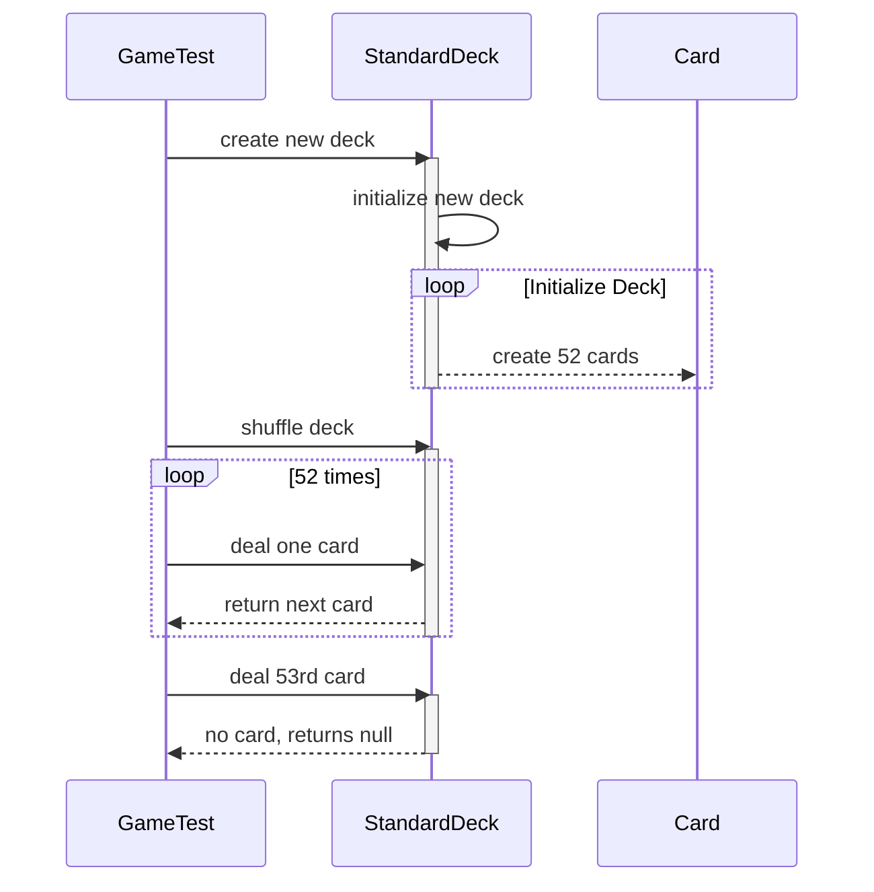

# Shuffle Card

Project is organized as a standard Maven project with very few external dependencies. To run the basic build and execute unit tests run

    mvn clean compile

To generate PMD, JUnit and Cobertura code coverage reports run 

    mvn site OR
    mvn clean compile site

Open index.html at

    target/site/cobertura/index.html

One PMD warning has been purposely left in the code to ensure that the PMD report is generated.

JUnit (using JAssert) test case located at

    src/test/java/com/gamesoft/cards/GameTest.java

# UML Sequence Diagram

UML diagrams are rendered using [Mermaid](https://mermaidjs.github.io/). 

